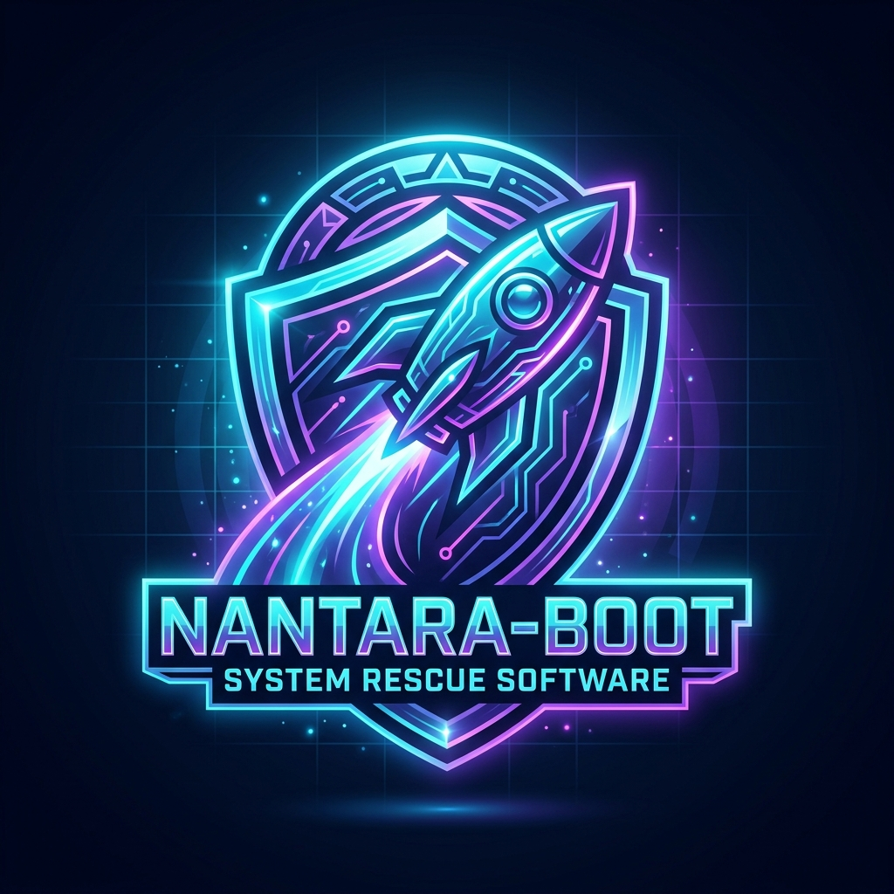

<p align="center">
  
</p>

<h1 align="center">🚀 Nantara-Boot</h1>

<p align="center">
  <strong>System Rescue Live OS / WinPE Toolkit</strong><br>
  100% Free & Open-Source Software (MIT License) ditenagai oleh bahasa <strong>Rust</strong> & <strong>Nantara AI Assistant</strong>
</p>

---

> **Nantara-Boot** adalah peranti penyelamat sistem (*System Rescue Live OS / WinPE Toolkit*) modern, ringan, dan serbaguna berbasis *Open Source*. Dirancang untuk teknisi IT, profesional keamanan, dan pengguna umum untuk pemulihan data, perbaikan boot, reset password, pemindaian virus offline, diagnosa hardware, serta penanganan insiden komputer secara instan.

---

## ✨ Fitur Unggulan (Key Features)

- 🖥️ **Nantara Native Standalone Desktop Window (v2.0 Engine)**:
  - Antarmuka GUI sekarang berjalan dalam **Jendela Aplikasi Desktop Mandiri** (*Standalone App Window*) tanpa membutuhkan browser bar (Chrome/Edge)!
- 🤖 **Nantara AI Rescue Assistant Engine**:
  - Asisten AI penyelamat sistem pertama di dunia pada Live Boot OS! Menganalisis kode error BSOD (`INACCESSIBLE_BOOT_DEVICE`, `0xC000021A`, dll) dalam mode **Offline Local SLM** maupun **Cloud Hybrid**.
- 🩺 **Smart Hardware Auto-Diagnostics**: Dasbor otomatis saat booting yang memeriksa kesehatan SSD/HDD (S.M.A.R.T), RAM, CPU, dan Baterai.
- ⚡ **1-Click Rescue Presets**:
  - **Smart Backup:** Menyalin folder `Desktop`, `Documents`, `Downloads`, dan `Pictures` dari Windows lokal ke drive eksternal dalam sekali klik.
  - **Smart Password Reset:** Mendeteksi akun Windows lokal dan mereset password dalam hitungan detik.
- 📱 **QR Code Emergency Guide**: Panduan perbaikan offline berbasis QR Code yang bisa di-scan dengan HP saat PC tidak terkoneksi internet.
- 🛡️ **Read-Only Safety Shield**: Perlindungan integritas data saat pemulihan file agar drive target tidak ter-overwrite.
- 🌐 **PXE / Network Boot Ready**: Mendukung booting dari jaringan lokal (LAN) tanpa memerlukan flashdisk tambahan.

---

## 🛠️ Kategori Utilitas di Dalamnya

| Kategori | Alat & Utilitas Utama |
| :--- | :--- |
| **BCD & Boot Repair** | EasyBCD, EasyUEFI, Bootice, Grub2Win, DISM++ |
| **Hard Disk & Partition** | AOMEI Partition Assistant, Macrorit, Victoria, HD Tune, CrystalDiskInfo |
| **Data Recovery** | Recuva, PhotoRec, TestDisk, GetDataBack, Everything Search |
| **Password & Security** | NT Password Edit, Lazesoft Recover My Password, BitLocker Unlock Tool |
| **Antivirus & Malware Scan**| Malwarebytes Portable, ESET Online Scanner, McAfee Stinger |
| **System Info & Hardware** | HWInfo, CPU-Z, GPU-Z, MemTest86 |
| **Network & Web Browser** | Chromium Portable, Firefox, AnyDesk, RustDesk, PuTTY, WinSCP |
| **Repair & License Recovery**| ShowKeyPlus, BlueScreenView, AppCrashView, Driver Backup |

---

## 📂 Struktur Repositori

```text
nantara-boot/
├── .github/              # Workflow CI/CD & Issue templates
├── build/                # Script otomasi builder (PowerShell & Config)
│   ├── build.ps1         # Script utama pembuatan ISO
│   ├── config.json       # Manifes daftar paket & unduhan utilitas
│   └── drivers/          # Driver pack (Storage NVMe, Wi-Fi, Touchpad)
├── src/                  # Source code Nantara Launcher (GUI & Script)
│   ├── launcher/         # Dasbor utama Nantara PE
│   └── widgets/          # Auto-Diagnostic & 1-Click Backup widgets
├── tools/                # Script pengunduh utilitas ter-kategorisasi
│   ├── bcd/
│   ├── disk/
│   ├── recovery/
│   ├── password/
│   ├── network/
│   ├── diagnostic/
│   └── repair/
├── docs/                 # Panduan dan dokumentasi pengguna
├── CONTRIBUTING.md       # Panduan kontribusi komunitas
├── LICENSE               # Lisensi proyek (MIT)
└── README.md             # Dokumentasi utama
```

---

## ⚙️ Cara Pembangunan ISO (Quick Start Builder)

### Persyaratan System Builder:
- Windows 10/11 (64-bit)
- PowerShell 5.1 / PowerShell 7+
- Windows ADK (opsional, disiapkan otomatis oleh script builder)

### Langkah Pembangunan:
```powershell
# 1. Clone repositori ini
git clone https://github.com/camanit/nantara-boot.git
cd nantara-boot

# 2. Jalankan script builder (mengunduh utilitas & merakit WinPE ISO)
.\build\build.ps1 -Target OS "Win11PE" -Architecture "x64"
```
Hasil file `Nantara-Boot-v1.0-x64.iso` akan dibuat di dalam folder `build/out/`.

---

## 🤝 Berkontribusi

Kami sangat menyambut kontribusi dari komunitas! Baik berupa penambahan script utilitas baru, perbaikan bug, penerjemahan bahasa, atau peningkatan UI Launcher.

Silakan baca [CONTRIBUTING.md](CONTRIBUTING.md) untuk mempelajari alur pengajuan *Pull Request*.

---

## 📄 Lisensi

Proyek **Nantara-Boot** dirilis di bawah lisensi [MIT License](LICENSE).
*(Catatan: Utilitas pihak ketiga yang diunduh saat proses build lokal tetap tunduk pada lisensi masing-masing pengembang). #CTARTech *
